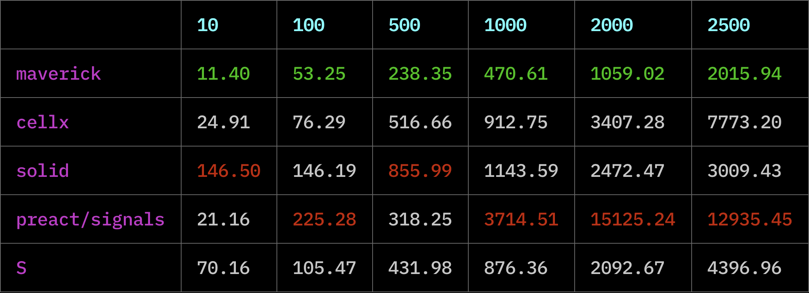
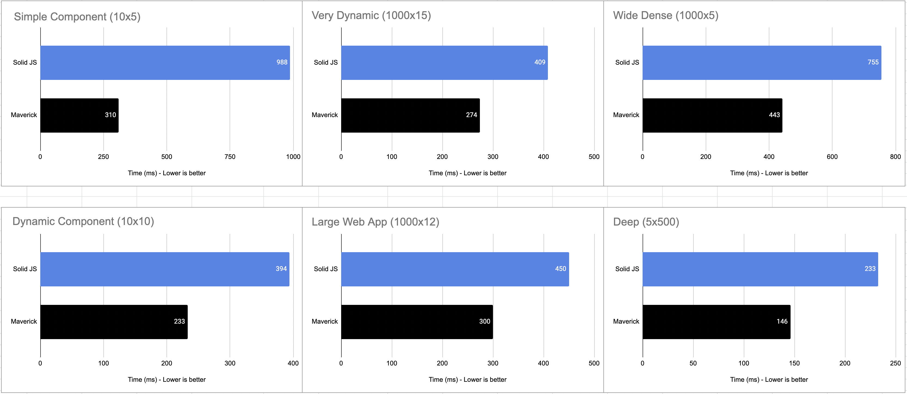

# Signals

[![package-badge]][package]
[![license-badge]][license]

> 🏆 The goal of this library is to provide a lightweight reactivity API for other UI libraries to
> be built on top of. It follows the "lazy principle" that Svelte adheres to - don't
> do any unnecessary work and don't place the burden of figuring it out on the developer.

This is a tiny (~1kB minzipped) library for creating reactive observables via functions called
signals. You can use signals to store state, create computed properties (`y = mx + b`), and subscribe
to updates as its value changes.

- 🪶 Light (~1kB minzipped)
- 💽 Works in both browsers and Node.js
- 🌎 All types are observable (i.e., string, array, object, etc.)
- 🕵️‍♀️ Only updates when value has changed
- ⏱️ Batched updates via microtask scheduler
- 😴 Lazy by default - efficiently re-computes only what's needed
- 🔬 Computations via `computed`
- 📞 Effect subscriptions via `effect`
- 🐛 Debugging identifiers
- 💪 Strongly typed - built with TypeScript

⏭️ **[Skip to API](#api)**

⏭️ **[Skip to TypeScript](#typescript)**

⏭️ **[Skip to Benchmarks](#benchmarks)**

Here's a simple demo to see how it works:

[][stackblitz-demo]

```js
import { root, signal, computed, effect, tick } from '@maverick-js/signals';

root((dispose) => {
  // Create - all types supported (string, array, object, etc.)
  const $m = signal(1);
  const $x = signal(1);
  const $b = signal(0);

  // Compute - only re-computed when `$m`, `$x`, or `$b` changes.
  const $y = computed(() => $m() * $x() + $b());

  // Effect - this will run whenever `$y` is updated.
  const stop = effect(() => {
    console.log($y());

    // Called each time `effect` ends and when finally disposed.
    return () => {};
  });

  $m.set(10); // logs `10` inside effect

  // Flush queue synchronously so effect is run.
  // Otherwise, effects will be batched and run on the microtask queue.
  tick();

  $b.set((prev) => prev + 5); // logs `15` inside effect

  tick();

  // Nothing has changed - no re-compute.
  $y();

  // Stop running effect.
  stop();

  // ...

  // Dispose of all signals inside `root`.
  dispose();
});
```

## Installation

```bash
$: npm i @maverick-js/signals

$: pnpm i @maverick-js/signals

$: yarn add @maverick-js/signals
```

## API

- [`root`](#root)
- [`signal`](#signal)
- [`computed`](#computed)
- [`effect`](#effect)
- [`peek`](#peek)
- [`untrack`](#untrack)
- [`readonly`](#readonly)
- [`tick`](#tick)
- [`computedMap`](#computedmap)
- [`computedKeyedMap`](#computedkeyedmap)
- [`onError`](#onerror)
- [`onDispose`](#ondispose)
- [`isReadSignal`](#isreadsignal)
- [`isWriteSignal`](#iswritesignal)
- [`getScope`](#getscope)
- [`scoped`](#scoped)
- [`getContext`](#getcontext)
- [`setContext`](#setcontext)

### `root`

Computations are generally child computations. When their respective parent scope is destroyed so
are they. You _can_ create orphan computations (i.e., no parent). Orphans will live in memory until
their internal object references are garbage collected (GC) (i.e., dropped from memory):

```js
import { computed } from '@maverick-js/signals';

const obj = {};

// This is an orphan - GC'd when `obj` is.
const $b = computed(() => obj);
```

Orphans can make it hard to determine when a computation is disposed so you'll generally want to
ensure you only create child computations. The `root` function stores all inner computations as
a child and provides a function to easily dispose of them all:

```js
import { root, signal, computed, effect } from '@maverick-js/signals';

root((dispose) => {
  const $a = signal(10);
  const $b = computed(() => $a());

  effect(() => console.log($b()));

  // Disposes of `$a`, $b`, and `effect`.
  dispose();
});
```

```js
// `root` returns the result of the given function.
const result = root(() => 10);

console.log(result); // logs `10`
```

### `signal`

Wraps the given value into a signal. The signal will return the current value when invoked `fn()`,
and provide a simple write API via `set()`. The value can now be observed when used
inside other computations created with [`computed`](#computed) and [`effect`](#effect).

```js
import { signal } from '@maverick-js/signals';

const $a = signal(10);

$a(); // read
$a.set(20); // write (1)
$a.set((prev) => prev + 10); // write (2)
```

> **Warning**
> Read the [`tick`](#tick) section below to understand batched updates.

### `computed`

Creates a new signal whose value is computed and returned by the given function. The given
compute function is _only_ re-run when one of it's dependencies are updated. Dependencies are
are all signals that are read during execution.

```js
import { signal, computed, tick } from '@maverick-js/signals';

const $a = signal(10);
const $b = signal(10);
const $c = computed(() => $a() + $b());

console.log($c()); // logs 20

$a.set(20);
tick();
console.log($c()); // logs 30

$b.set(20);
tick();
console.log($c()); // logs 40

// Nothing changed - no re-compute.
console.log($c()); // logs 40
```

```js
import { signal, computed } from '@maverick-js/signals';

const $a = signal(10);
const $b = signal(10);
const $c = computed(() => $a() + $b());

// Computed signals can be deeply nested.
const $d = computed(() => $a() + $b() + $c());
const $e = computed(() => $d());
```

### `effect`

Invokes the given function each time any of the signals that are read inside are updated
(i.e., their value changes). The effect is immediately invoked on initialization.

```js
import { signal, computed, effect } from '@maverick-js/signals';

const $a = signal(10);
const $b = signal(20);
const $c = computed(() => $a() + $b());

// This effect will run each time `$a` or `$b` is updated.
const stop = effect(() => console.log($c()));

// Stop observing.
stop();
```

You can optionally return a function from inside the `effect` that will be run each time the
effect re-runs and when it's finally stopped/disposed of:

```js
effect(() => {
  return () => {
    // Called each time effect re-runs and when disposed of.
  };
});
```

### `peek`

Returns the current value stored inside the given compute function whilst disabling observer tracking, i.e.
without triggering any dependencies. Use [`untrack`](#untrack) if you want to also disable scope tracking.

```js
import { signal, computed, peek } from '@maverick-js/signals';

const $a = signal(10);

const $b = computed(() => {
  // `$a` will not trigger updates on `$b`.
  const value = peek($a);
});
```

### `untrack`

Returns the current value inside a signal whilst disabling both scope _and_ observer
tracking. Use [`peek`](#peek) if only observer tracking should be disabled.

```js
import { signal, effect, untrack } from '@maverick-js/signals';

effect(() => {
  untrack(() => {
    // `$a` is now an orphan and also not tracked by the outer effect.
    const $a = signal(10);
  });
});
```

### `readonly`

Takes in the given signal and makes it read only by removing access to write operations (i.e.,
`set()`).

```js
import { signal, readonly } from '@maverick-js/signals';

const $a = signal(10);
const $b = readonly($a);

console.log($b()); // logs 10

// We can still update value through `$a`.
$a.set(20);

console.log($b()); // logs 20
```

### `tick`

By default, signal updates are batched on the microtask queue which is an async process. You can
flush the queue synchronously to get the latest updates by calling `tick()`.

> **Note**
> You can read more about microtasks on [MDN][mdn-microtasks].

```js
import { signal } from '@maverick-js/signals';

const $a = signal(10);

$a.set(10);
$a.set(20);
$a.set(30); // only this write is applied
```

```js
import { signal, tick } from '@maverick-js/signals';

const $a = signal(10);

// All writes are applied.
$a.set(10);
tick();
$a.set(20);
tick();
$a.set(30);
```

### `computedMap`

> **Note**
> Same implementation as [`indexArray`](https://www.solidjs.com/docs/latest/api#indexarray) in Solid JS.
> Prefer [`computedKeyedMap`](#computedkeyedmap) when referential checks are required.

Reactive map helper that caches each item by index to reduce unnecessary mapping on updates.
It only runs the mapping function once per item and adds/removes as needed. In a non-keyed map like
this the index is fixed but value can change (opposite of a keyed map).

```js
import { signal, tick } from '@maverick-js/signals';
import { computedMap } from '@maverick-js/signals/map';

const source = signal([1, 2, 3]);

const map = computedMap(source, (value, index) => {
  return {
    i: index,
    get id() {
      return value() * 2;
    },
  };
});

console.log(map()); // logs `[{ i: 0, id: $2 }, { i: 1, id: $4 }, { i: 2, id: $6 }]`

source.set([3, 2, 1]);
tick();

// Notice the index `i` remains fixed but `id` has updated.
console.log(map()); // logs `[{ i: 0, id: $6 }, { i: 1, id: $4 }, { i: 2, id: $2 }]`
```

### `computedKeyedMap`

> **Note**
> Same implementation as [`mapArray`](https://www.solidjs.com/docs/latest/api#maparray) in Solid JS.
> Prefer [`computedMap`](#computedmap) when working with primitives to avoid unnecessary re-renders.

Reactive map helper that caches each list item by reference to reduce unnecessary mapping on
updates. It only runs the mapping function once per item and then moves or removes it as needed. In
a keyed map like this the value is fixed but the index changes (opposite of non-keyed map).

```js
import { signal, tick } from '@maverick-js/signals';
import { computedKeyedMap } from '@maverick-js/signals/map';

const source = signal([{ id: 0 }, { id: 1 }, { id: 2 }]);

const nodes = computedKeyedMap(source, (value, index) => {
  const div = document.createElement('div');

  div.setAttribute('id', String(value.id));
  Object.defineProperty(div, 'i', {
    get() {
      return index();
    },
  });

  return div;
});

console.log(nodes()); // [{ id: 0, i: $0 }, { id: 1, i: $1 }, { id: 2, i: $2 }];

source.set((prev) => {
  // Swap index 0 and 1
  const tmp = prev[1];
  prev[1] = prev[0];
  prev[0] = tmp;
  return [...prev]; // new array
});

tick();

// No nodes were created/destroyed, simply nodes at index 0 and 1 switched.
console.log(nodes()); // [{ id: 1, i: $0 }, { id: 0, i: $1 }, { id: 2, i: $2 }];
```

### `onError`

Runs the given function when an error is thrown in a child scope. If the error is thrown again
inside the error handler, it will trigger the next available parent scope handler.

```js
import { effect, onError } from '@maverick-js/signals';

effect(() => {
  onError((error) => {
    // ...
  });
});
```

### `onDispose`

Runs the given function when the parent scope computation is being disposed of.

```js
import { effect, onDispose } from '@maverick-js/signals';

const listen = (type, callback) => {
  window.addEventListener(type, callback);
  // Called when the effect is re-run or finally disposed.
  onDispose(() => window.removeEventListener(type, callback));
};

const stop = effect(
  listen('click', () => {
    // ...
  }),
);

stop(); // `onDispose` is called
```

The `onDispose` callback will return a function to clear the disposal early if it's no longer
required:

```js
effect(() => {
  const dispose = onDispose(() => {});
  // ...
  // Call early if it's no longer required.
  dispose();
});
```

### `isReadSignal`

Whether the given value is a readonly signal.

```js
// True
isReadSignal(10);
isReadSignal(() => {});
isReadSignal(signal(10));
isReadSignal(computed(() => 10));
isReadSignal(readonly(signal(10)));

// False
isReadSignal(false);
isReadSignal(null);
isReadSignal(undefined);
```

### `isWriteSignal`

Whether the given value is a write signal (i.e., can produce new values via write API).

```js
// True
isWriteSignal(signal(10));

// False
isWriteSignal(false);
isWriteSignal(null);
isWriteSignal(undefined);
isWriteSignal(() => {});
isWriteSignal(computed(() => 10));
isWriteSignal(readonly(signal(10)));
```

### `getScope`

Returns the currently executing parent scope.

```js
root(() => {
  const scope = getScope(); // returns `root` scope.

  effect(() => {
    const $a = signal(0);
    getScope(); // returns `effect` scope.
  });
});
```

### `scoped`

Runs the given function in the given scope so context and error handling continue to work.

```js
import { root, getScope, scoped } from '@maverick-js/signals';

root(() => {
  const scope = getScope();

  // Timeout will lose tracking of the current scope.
  setTimeout(() => {
    scoped(() => {
      // Code here will run with root scope.
    }, scope);
  }, 0);
});
```

### `getContext`

Attempts to get a context value for the given key. It will start from the parent scope and
walk up the computation tree trying to find a context record and matching key. If no value can be
found `undefined` will be returned. This is intentionally low-level so you can design a context API
in your library as desired.

In your implementation make sure to check if a parent scope exists via `getScope()`. If one does
not exist log a warning that this function should not be called outside a computation or render
function.

> **Note**
> See the `setContext` code example below for a demo of this function.

### `setContext`

Attempts to set a context value on the parent scope with the given key. This will be a no-op if
no parent scope is defined. This is intentionally low-level so you can design a context API in your
library as desired.

In your implementation make sure to check if a parent scope exists via `getScope()`. If one does
not exist log a warning that this function should not be called outside a computation or render
function.

```js
import { root, getContext, setContext } from '@maverick-js/signals';

const key = Symbol();

root(() => {
  setContext(key, 100);
  // ...
  root(() => {
    const value = getContext(key); // 100
  });
});
```

## Debugging

The `signal`, `computed`, and `effect` functions accept a debugging ID (string) as part
of their options.

```js
import { signal, computed } from '@maverick-js/signals';

const $foo = signal(10, { id: 'foo' });
```

> **Note**
> This feature is only available in a development or testing Node environment (i.e., `NODE_ENV`).

## TypeScript

```ts
import {
  isReadSignal,
  isWriteSignal,
  type Effect,
  type ReadSignal,
  type WriteSignal,
  type MaybeSignal,
} from '@maverick-js/signals';

// Types
const signal: ReadSignal<number>;
const computed: ReadSignal<string>;
const effect: Effect;

// Provide generic if TS fails to infer correct type.
const $a = computed<string>(() => /* ... */);

const $b: MaybeSignal<number>;

if (isReadSignal($b)) {
  $b(); // ReadSignal<number>
}

if (isWriteSignal($b)) {
  $b.set(10); // WriteSignal<number>
}
```

## Benchmarks

### Layers

This benchmark was taken from [`cellx`](https://github.com/Riim/cellx#benchmark). It
tests how long it takes for an `n` deeply layered computation to update. The benchmark can be
found [here](./bench/layers.js).

Each column represents how deep computations were layered. The average time taken to update the
computation out of a 100 runs is used for each library.



#### Notes

- Nearly all computations in a real world app are going to be less than 10 layers deep, so only the
  first column really matters.
- This benchmark favours eagerly scheduling computations and aggresive caching in a single long
  computation subtree. This is not a great benchmark for signals libraries as it doesn't measure
  what really matters such as dynamic graph updates, source/observer changes, and scope disposals.

### Reactively

This benchmark was taken from [`reactively`](https://github.com/modderme123/reactively). It sets
up various computation graphs with a set number of sources (e.g., `1000x5` is 1000 computations with
a tree depth of 5). The benchmark measures how long it takes for changes to be applied after static
or dynamic updates are made to the graph (i.e., pick a node and update its value).



#### Notes

- This assumes Solid JS is in batch-only mode which is not realistic as a real world app won't
  have batch applied everywhere.

## Inspiration

`@maverick-js/signals` was made possible based on code and learnings from:

- [Reactively][reactively]
- [Solid JS][solidjs]
- [Sinuous][sinuous]
- [Hyperactiv][hyperactiv]
- [Svelte Scheduler][svelte-scheduler]

Special thanks to Modderme, Wesley, Julien, and Solid/Svelte contributors for all their work 🎉

[package]: https://www.npmjs.com/package/@maverick-js/signals
[package-badge]: https://img.shields.io/npm/v/@maverick-js/signals/latest
[license]: https://github.com/maverick-js/signals/blob/main/LICENSE
[license-badge]: https://img.shields.io/github/license/maverick-js/signals
[size-badge]: https://img.shields.io/bundlephobia/minzip/@maverick-js/signals@^5.0.0
[reactively]: https://github.com/modderme123/reactively
[solidjs]: https://github.com/solidjs/solid
[sinuous]: https://github.com/luwes/sinuous
[hyperactiv]: https://github.com/elbywan/hyperactiv
[svelte-scheduler]: https://github.com/sveltejs/svelte/blob/master/src/runtime/internal/scheduler.ts
[mdn-microtasks]: https://developer.mozilla.org/en-US/docs/Web/API/HTML_DOM_API/Microtask_guide
[stackblitz-demo]: https://stackblitz.com/edit/maverick-signals?embed=1&file=index.ts&hideExplorer=1&hideNavigation=1&view=editor
[bundlephobia]: https://bundlephobia.com/package/@maverick-js/signals@^5.0.0
[maverick-scheduler]: https://github.com/maverick-js/scheduler
