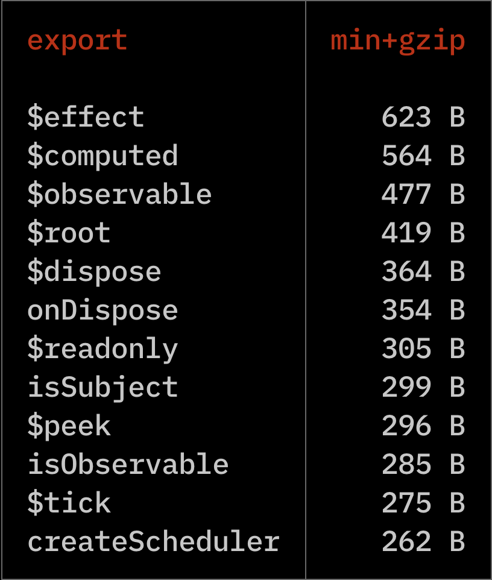

# Observables

[![package-badge]][package]
[![license-badge]][license]
[![size-badge]][bundlephobia]

> 🏆 The goal of this library is to provide a lightweight reactivity API for other UI libraries to
> be built on top of. It follows the "lazy principle" that Svelte adheres to - don't
> do any unnecessary work and don't place the burden of figuring it out on the developer.

This is a tiny (~850B minzipped) library for creating reactive observables via functions. You
can use observables to store state, create computed properties (`y = mx + b`), and subscribe to
updates as its value changes.

- 🪶 Light (~850B minzipped)
- 💽 Works in both browsers and Node.js
- 🌎 All types are observable (i.e., string, array, object, etc.)
- 🕵️‍♀️ Only updates when value has changed
- ⏱️ Batched updates via microtask scheduler
- 😴 Lazy by default - efficiently re-computes only what's needed
- 🔬 Computations via `computed`
- 📞 Effect subscriptions via `effect`
- ♻️ Detects cyclic dependencies
- 🐛 Debugging identifiers
- 💪 Strongly typed - built with TypeScript

⏭️ **[Skip to API](#api)**

⏭️ **[Skip to TypeScript](#typescript)**

⏭️ **[Skip to Benchmarks](#benchmarks)**

Here's a simple demo to see how it works:

[][stackblitz-demo]

```js
import { root, observable, computed, effect, tick } from '@maverick-js/observables';

root(async (dispose) => {
  // Create - all types supported (string, array, object, etc.)
  const $m = observable(1);
  const $x = observable(1);
  const $b = observable(0);

  // Compute - only re-computed when `$m`, `$x`, or `$b` changes.
  const $y = computed(() => $m() * $x() + $b());

  // Effect - this will run whenever `$y` is updated.
  const stop = effect(() => {
    console.log($y());

    // Called each time `effect` ends and when finally disposed.
    return () => {};
  });

  $m.set(10); // logs `10` inside effect

  // Wait a tick so update is applied and effect is run.
  await tick();

  $b.next((prev) => prev + 5); // logs `15` inside effect

  // Wait a tick so effect runs last update.
  await tick();

  // Nothing has changed - no re-compute.
  $y();

  // Stop running effect.
  stop();

  // ...

  // Dispose of all observables inside `root`.
  dispose();
});
```

## Export Sizes



**Average:** ~600B.
**Total:** ~850B.

You can also check out the library size on [Bundlephobia][bundlephobia] (less accurate).

## Installation

```bash
$: npm i @maverick-js/observables

$: pnpm i @maverick-js/observables

$: yarn add @maverick-js/observables
```

## API

- [`root`](#root)
- [`observable`](#observable)
- [`computed`](#computed)
- [`effect`](#effect)
- [`peek`](#peek)
- [`readonly`](#readonly)
- [`tick`](#tick)
- [`computedMap`](#computedmap)
- [`computedKeyedMap`](#computedkeyedmap)
- [`dispose`](#dispose)
- [`onDispose`](#ondispose)
- [`isObservable`](#isobservable)
- [`isSubject`](#issubject)
- [`getParent`](#getparent)
- [`getScheduler`](#getscheduler)

## `root`

Computations are generally child computations. When their respective parent is destroyed so are
they. You _can_ create orphan computations (i.e., no parent). Orphans will live in memory until
their internal object references are garbage collected (GC) (i.e., dropped from memory):

```js
import { computed } from '@maverick-js/observables';

const obj = {};

// This is an orphan - GC'd when `obj` is.
const $b = computed(() => obj);
```

Orphans can make it hard to determine when a computation is disposed so you'll generally want to
ensure you only create child computations. The `root` function stores all inner computations as
a child and provides a function to easily dispose of them all:

```js
import { root, observable, computed, effect } from '@maverick-js/observables';

root((dispose) => {
  const $a = observable(10);
  const $b = computed(() => $a());

  effect(() => console.log($b()));

  // Disposes of `$a`, $b`, and `effect`.
  dispose();
});
```

```js
// `root` returns the result of the given function.
const result = root(() => 10);

console.log(result); // logs `10`
```

### `observable`

Wraps the given value into an observable function. The observable function will return the
current value when invoked `fn()`, and provide a simple write API via `set()` and `next()`. The
value can now be observed when used inside other computations created with [`computed`](#computed)
and [`effect`](#effect).

```js
import { observable } from '@maverick-js/observables';

const $a = observable(10);

$a(); // read
$a.set(20); // write (1)
$a.next((prev) => prev + 10); // write (2)
```

> **Warning**
> Read the [`tick`](#tick) section below to understand batched updates.

### `computed`

Creates a new observable whose value is computed and returned by the given function. The given
compute function is _only_ re-run when one of it's dependencies are updated. Dependencies are
are all observables that are read during execution.

```js
import { observable, computed, tick } from '@maverick-js/observables';

const $a = observable(10);
const $b = observable(10);
const $c = computed(() => $a() + $b());

console.log($c()); // logs 20

$a.set(20);
await tick();
console.log($c()); // logs 30

$b.set(20);
await tick();
console.log($c()); // logs 40

// Nothing changed - no re-compute.
console.log($c()); // logs 40
```

```js
import { observable, computed } from '@maverick-js/observables';

const $a = observable(10);
const $b = observable(10);
const $c = computed(() => $a() + $b());

// Computed observables can be deeply nested.
const $d = computed(() => $a() + $b() + $c());
const $e = computed(() => $d());
```

### `effect`

Invokes the given function each time any of the observables that are read inside are updated
(i.e., their value changes). The effect is immediately invoked on initialization.

```js
import { observable, computed, effect } from '@maverick-js/observables';

const $a = observable(10);
const $b = observable(20);
const $c = computed(() => $a() + $b());

// This effect will run each time `$a` or `$b` is updated.
const stop = effect(() => console.log($c()));

// Stop observing.
stop();
```

You can optionally return a function from inside the `effect` that will be run each time the
effect re-runs and when it's finally stopped/disposed of:

```js
effect(() => {
  return () => {
    // Called each time effect re-runs and when disposed of.
  };
});
```

### `peek`

Returns the current value stored inside an observable without triggering a dependency.

```js
import { observable, computed, peek } from '@maverick-js/observables';

const $a = observable(10);

computed(() => {
  // `$a` will not be considered a dependency.
  const value = peek($a);
});
```

### `readonly`

Takes in the given observable and makes it read only by removing access to write
operations (i.e., `set()` and `next()`).

```js
import { observable, readonly } from '@maverick-js/observables';

const $a = observable(10);
const $b = readonly($a);

console.log($b()); // logs 10

// We can still update value through `$a`.
$a.set(20);

console.log($b()); // logs 20
```

### `tick`

Tasks are batched onto the microtask queue. This means only the last write of multiple write
actions performed in the same execution window is applied. You can wait for the microtask
queue to be flushed before writing a new value so it takes effect.

> **Note**
> You can read more about microtasks on [MDN][mdn-microtasks].

```js
import { observable } from '@maverick-js/observables';

const $a = observable(10);

$a.set(10);
$a.set(20);
$a.set(30); // only this write is applied
```

```js
import { observable, tick } from '@maverick-js/observables';

const $a = observable(10);

// All writes are applied.
$a.set(10);
await tick();
$a.set(20);
await tick();
$a.set(30);
```

### `computedMap`

> **Note**
> Same implementation as [`indexArray`](https://www.solidjs.com/docs/latest/api#indexarray) in Solid JS.
> Prefer [`computedKeyedMap`](#computedkeyedmap) when mapping to expensive objects like DOM nodes.

Reactive map helper that caches each item by index to reduce unnecessary mapping on updates.
It only runs the mapping function once per item and adds/removes as needed. The list item is an
observable. The map function itself is not tracking - only applied once.

```js
import { observable, tick, computedMap } from '@maverick-js/observables';

const source = observable([1, 2, 3]);

const map = computedMap(source, (value, index) => {
  return {
    i: index,
    get id() {
      return value() * 2;
    },
  };
});

console.log(map()); // logs `[{ i: 0, id: $2 }, { i: 1, id: $4 }, { i: 2, id: $6 }]`

source.set([3, 2, 1]);
await tick();

// Notice the index `i` remains fixed but `id` has updated.
console.log(map()); // logs `[{ i: 0, id: $6 }, { i: 1, id: $4 }, { i: 2, id: $2 }]`
```

### `computedKeyedMap`

> **Note**
> Same implementation as [`mapArray`](https://www.solidjs.com/docs/latest/api#maparray) in Solid JS.
> Prefer [`computedMap`](#computedmap) when working with primitives to avoid unnecessary re-renders.

Reactive map helper that caches each list item by reference to reduce unnecessary mapping on
updates. It only runs the mapping function once per item and then moves or removes it as needed.
The index argument is an observable. The map function itself is not tracking - only applied once.

Use this when you have expensive data computations per each list item or you want to avoid
re-creating heavy objects on each update. A good use-case is when you're working with a collection
of DOM nodes.

```js
import { observable, tick, computedKeyedMap } from '@maverick-js/observables';

const source = observable([{ id: 0 }, { id: 1 }, { id: 2 }]);

const nodes = computedKeyedMap(source, (value, index) => {
  const div = document.createElement('div');

  div.setAttribute('id', String(value.id));
  Object.defineProperty(div, 'i', {
    get() {
      return index();
    },
  });

  return div;
});

console.log(nodes()); // [{ id: 0, i: $0 }, { id: 1, i: $1 }, { id: 2, i: $2 }];

source.next((prev) => {
  // Swap index 0 and 1
  const tmp = prev[1];
  prev[1] = prev[0];
  prev[0] = tmp;
  return [...prev]; // new array
});

await tick();

// No nodes were created/destroyed, simply nodes at index 0 and 1 switched.
console.log(nodes()); // [{ id: 1, i: $0 }, { id: 0, i: $1 }, { id: 2, i: $2 }];
```

### `dispose`

Unsubscribes the given observable and optionally all inner computations. Disposed functions will
retain their current value but are no longer reactive.

```js
import { observable, dispose } from '@maverick-js/observables';

const $a = observable(10);
const $b = computed(() => $a());

// `$b` will no longer update if `$a` is updated.
dispose($a);

$a.set(100);
console.log($b()); // still logs `10`
```

## `onDispose`

Runs the given function when the parent computation is disposed of:

```js
import { effect, onDispose } from '@maverick-js/observables';

const listen = (type, callback) => {
  window.addEventListener(type, callback);
  // Called when the effect is re-run or finally disposed.
  onDispose(() => window.removeEventListener(type, callback));
};

const stop = effect(
  listen('click', () => {
    // ...
  }),
);

stop(); // `onDispose` is called
```

The `onDispose` callback will return a function to clear the disposal early if it's no longer
required:

```js
effect(() => {
  const dispose = onDispose(() => {});
  // ...
  // Call early if it's no longer required.
  dispose();
});
```

### `isObservable`

Whether the given value is an observable (readonly).

```js
// True
isObservable(observable(10));
isObservable(computed(() => 10));
isObservable(readonly(observable(10)));

// False
isObservable(false);
isObservable(null);
isObservable(undefined);
isObservable(() => {});
```

### `isSubject`

Whether the given value is an observable subject (i.e., can produce new values via write API).

```js
// True
isSubject(observable(10));

// False
isSubject(false);
isSubject(null);
isSubject(undefined);
isSubject(() => {});
isSubject(computed(() => 10));
isSubject(readonly(observable(10)));
```

### `getParent`

Returns the parent/owner of the given function (if defined). You can use this function to
recursively walk up the computation tree (useful for implementing a context API).

```js
root(() => {
  const $a = observable(0);
  getParent($a); // returns `root`
});
```

### `getScheduler`

Returns the global scheduler which can be used to queue additional tasks or synchronously flush
the queue.

```js
const scheduler = getScheduler();

// Queue task
scheduler.enqueue(() => {
  // ...
});

// Flush queue synchronously
scheduler.syncFlush();
```

> **Note**
> See our [Scheduler][maverick-scheduler] repo for more information.

## Debugging

The `observable`, `computed`, and `effect` functions accept a debugging ID (string) as part
of their options. This can be helpful when logging a cyclic dependency chain to understand
where it's occurring.

```js
import { observable, computed } from '@maverick-js/observables';

const $a = observable(10, { id: 'a' });

// Cyclic dependency chain.
const $b = computed(() => $a() + $c(), { id: 'b' });
const $c = computed(() => $a() + $b(), { id: 'c' });

// This will throw an error in the form:
// $: Error: cyclic dependency detected
// $: a -> b -> c -> b
```

> **Note**
> This feature is only available in a development or testing Node environment (i.e., `NODE_ENV`).

## TypeScript

```ts
import {
  isObservable,
  isSubject,
  type Effect,
  type Observable,
  type MaybeObservable,
} from '@maverick-js/observables';

// Types
const observable: Observable<number>;
const computed: Observable<string>;
const effect: Effect;

// Provide generic if TS fails to infer correct type.
const $a = computed<string>(() => /* ... */);

const $b: MaybeObservable<number>;

if (isObservable($b)) {
  $b(); // Observable<number>
}

if (isSubject($b)) {
  $b.set(10); // ObservableSubject<number>
}
```

## Benchmarks

### Layers

This benchmark was taken from [`cellx`](https://github.com/Riim/cellx#benchmark). It
tests how long it takes for an `n` deeply layered computation to update. The benchmark can be
found [here](./bench/layers.js).

Each column represents how deep computations were layered. The average time taken to update the
computation out of a 100 runs is used for each library.

> **Don't take this benchmark too seriously because it hasn't been reviewed properly at all.**


## Inspiration

`@maverick-js/observables` was made possible based on my learnings from:

- [Solid JS][solidjs]
- [Sinuous][sinuous]
- [Hyperactiv][hyperactiv]
- [Svelte Scheduler][svelte-scheduler]

Special thanks to Wesley, Julien, and Solid/Svelte contributors for all their work 🎉

[package]: https://www.npmjs.com/package/@maverick-js/observables
[package-badge]: https://img.shields.io/npm/v/@maverick-js/observables/latest
[license]: https://github.com/maverick-js/observables/blob/main/LICENSE
[license-badge]: https://img.shields.io/github/license/maverick-js/observables
[size-badge]: https://img.shields.io/bundlephobia/minzip/@maverick-js/observables@^4.0.0
[solidjs]: https://github.com/solidjs/solid
[sinuous]: https://github.com/luwes/sinuous
[hyperactiv]: https://github.com/elbywan/hyperactiv
[svelte-scheduler]: https://github.com/sveltejs/svelte/blob/master/src/runtime/internal/scheduler.ts
[mdn-microtasks]: https://developer.mozilla.org/en-US/docs/Web/API/HTML_DOM_API/Microtask_guide
[stackblitz-demo]: https://stackblitz.com/edit/maverick-observables?embed=1&file=index.ts&hideExplorer=1&hideNavigation=1&view=editor
[bundlephobia]: https://bundlephobia.com/package/@maverick-js/observables@^4.0.0
[maverick-scheduler]: https://github.com/maverick-js/scheduler
